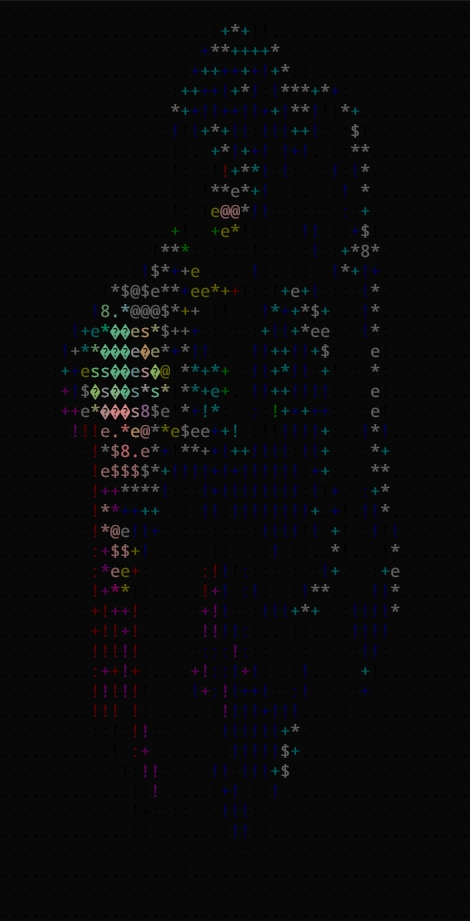

# asciify

- Converts `jpeg\png` images/videos to `ascii` and prints to terminal.
#### Build :
---
```shell
	$ sudo apt install ffmpeg
	$ git clone https://github.com/xenorivai/asciify.git
	$ make

```
- Usage : `./main [path-to-file] -[mode]{v,i}`
	- example :  
		`./main ./img/homer.png -i`

		`./main ./img/ball.mp4 -v`

##### Results :





#### Dependencies:
- ffmpeg
- [stb_image](https://github.com/nothings/stb)